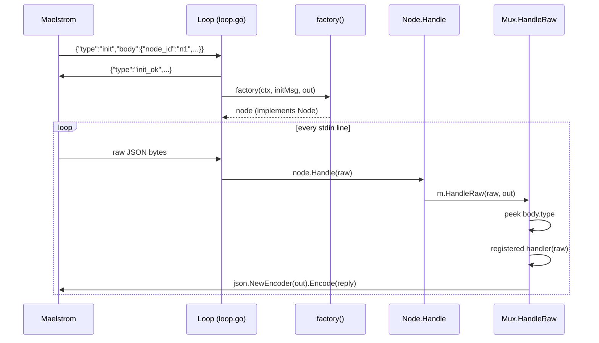

# argo — Gossip Glomers in Go

A Go implementation of the Gossip Glomers distributed-systems challenge series, run and verified by the Maelstrom fault-injection harness. Each challenge compiles to a standalone binary that speaks the Maelstrom line-delimited JSON protocol over stdin/stdout.

- Repository: johnmayou/argo
- Branch: default
- Generated at: 2026-05-28T16:27:29.226Z
- Pages exported: 1/1

## Pages

- [[01-start-here-repo-map-entry-points-core-abstractions|Start Here — Repo Map, Entry Points & Core Abstractions]]

## Files

<details>
<summary>Relevant source files</summary>
The following files were used as context for generating this wiki page:

- [README.md](README.md)
- [go.mod](go.mod)
- [Makefile](Makefile)
- [internal/argo/loop.go](internal/argo/loop.go)
- [internal/argo/message.go](internal/argo/message.go)
- [internal/argo/mux.go](internal/argo/mux.go)
- [internal/hashset/hashset.go](internal/hashset/hashset.go)
- [cmd/echo/main.go](cmd/echo/main.go)
- [cmd/unique-ids/main.go](cmd/unique-ids/main.go)
- [cmd/broadcast/main.go](cmd/broadcast/main.go)
</details>

# Start Here — Repo Map, Entry Points & Core Abstractions

`argo` is a collection of Go solutions to the [Gossip Glomers](https://fly.io/dist-sys/) distributed systems challenge series, tested under the [Maelstrom](https://github.com/jepsen-io/maelstrom) workload harness. Each challenge compiles to a standalone binary that Maelstrom drives over stdin/stdout, injecting network partitions and measuring correctness.

This page names every file worth opening first, explains how `internal/argo` wires the `Node → Mux → Loop` pipeline, details the gossip broadcast pattern used in challenges 3a–3e, lists the Make targets that build and test each binary, and defines the local terms a new reader will encounter before they touch any code.

---

## Repo Map

```text
argo/
├── cmd/
│   ├── echo/           main.go   — challenge #1 (echo)
│   ├── unique-ids/     main.go   — challenge #2 (unique ID generation)
│   └── broadcast/      main.go   — challenges #3a–3e (broadcast + gossip)
├── internal/
│   ├── argo/
│   │   ├── loop.go     — init handshake + main read loop
│   │   ├── message.go  — Message[B], Body interface, BaseBody
│   │   └── mux.go      — Mux type-router + generic register/handle helpers
│   └── hashset/
│       └── hashset.go  — generic set backed by map[T]struct{}
├── bin/                — compiled binaries (git-ignored, written by make)
├── maelstrom/
│   └── maelstrom       — bundled Maelstrom binary
├── go.mod
├── Makefile
└── README.md
```

**What to open first:**

1. `internal/argo/loop.go` — the runtime skeleton every binary shares
2. `internal/argo/mux.go` — how messages are dispatched
3. `cmd/echo/main.go` — the simplest possible node, one handler
4. `cmd/broadcast/main.go` — adds gossip, topology, and per-neighbor tracking

Sources: [go.mod:1](), [README.md:26-36]()

---

## Core Abstractions

### `Message[B Body]` — the wire envelope

Every message on the wire is represented as a generic struct:

```go
// internal/argo/message.go
type Message[B Body] struct {
    Src  string `json:"src"`
    Dst  string `json:"dest"`
    Body B      `json:"body"`
}
```

`B` must satisfy the `Body` interface, which requires `GetType()`, `GetID()`, and `GetInReplyTo()`. The concrete `BaseBody` struct implements the interface and is embedded in every challenge-specific body type, providing the `type`, `msg_id`, and `in_reply_to` fields that the Maelstrom protocol demands.

Sources: [internal/argo/message.go:3-25]()

### `Node` — the handler contract

```go
// internal/argo/loop.go
type Node interface {
    Handle(raw []byte)
}
```

Every challenge binary defines a struct that holds its state (node ID, mux, output writer, and any domain data) and implements `Handle`. The loop calls `Handle` with the raw JSON bytes of each incoming line; the node is responsible for routing them further.

Sources: [internal/argo/loop.go:13-15]()

### `Mux` — the type router

`Mux` maps a `MessageType` string to a typed handler function. Two generic free functions do the heavy lifting:

| Function                                | Role                                                                                                        |
| --------------------------------------- | ----------------------------------------------------------------------------------------------------------- |
| `MuxRegister[B Body](m, type, handler)` | Registers a handler; the wrapper unmarshals raw bytes into `Message[B]` before calling `handler`            |
| `MuxHandle[B Body](m, msg, out)`        | Marshals an outbound `Message[B]` back to raw bytes and re-routes it through the mux (used for self-gossip) |
| `(m *Mux) HandleRaw(raw, out)`          | Peeks at `body.type`, looks up the registered handler, and calls it                                         |
| `NoOpHandler[B Body]`                   | A pre-built no-op for message types the node must accept but not act on                                     |

The two-step decode (peek type → full unmarshal) lets each handler receive a strongly-typed `Message[B]` without a reflect-heavy dispatcher.

Sources: [internal/argo/mux.go:9-53]()

### `Loop` / `MainLoop` — the runtime skeleton

```go
// internal/argo/loop.go
func MainLoop[N Node](
    factory func(context.Context, Message[InitBody], io.Writer) N,
)
```

`MainLoop` is the only function a `main()` calls. It binds `os.Stdin`/`os.Stdout` and delegates to `Loop`, which:

1. Reads exactly one line — the Maelstrom `init` message
2. Responds immediately with `init_ok`
3. Calls `factory(ctx, initMsg, out)` to construct the application node
4. Enters a `for scanner.Scan()` loop, calling `node.Handle(raw)` for every subsequent line

Sources: [internal/argo/loop.go:32-82]()

---

## How Node → Mux → Loop Wire Together



Every `main()` in `cmd/` is a one-liner:

```go
// cmd/echo/main.go:69
func main() {
    argo.MainLoop(NewEchoNode)
}
```

The factory `NewEchoNode` (or `NewBroadcastNode`, etc.) creates the node struct, registers handlers on its `Mux`, and returns. From that point on, `Loop` owns the I/O.

Sources: [cmd/echo/main.go:33-49](), [cmd/broadcast/main.go:67-89]()

---

## The Init Handshake

The Maelstrom protocol mandates that the very first message to any node is `init`. `Loop` hard-codes this assumption: if the first `scanner.Scan()` fails or does not decode as `Message[InitBody]`, the process exits with an error.

The `InitBody` carries two fields the node needs to keep:

| Field     | JSON key   | Meaning                           |
| --------- | ---------- | --------------------------------- |
| `NodeID`  | `node_id`  | This node's address (e.g. `"n1"`) |
| `NodeIDs` | `node_ids` | All nodes in the cluster          |

The factory receives the full `init` message, so it can extract both fields at construction time without any post-init configuration step.

Sources: [internal/argo/loop.go:22-29, 56-73]()

---

## The Gossip Broadcast Pattern

`cmd/broadcast/main.go` implements challenges 3a–3e. Single-node broadcast is trivial, but multi-node requires propagating messages across the cluster. The solution uses **anti-entropy gossip with per-neighbor delta tracking**.

### State the node keeps

```go
// cmd/broadcast/main.go:57-65
type BroadcastNode struct {
    ...
    Neighborhood []string                       // neighbors from topology
    Messages     *hashset.HashSet[int]           // all messages ever seen
    Known        map[string]*hashset.HashSet[int] // per-neighbor: what they already have
    ...
}
```

`Messages` is a set of every integer the node has received via `broadcast` or `gossip`. `Known[neighbor]` tracks which of those integers have already been sent to (and confirmed seen by) that neighbor, so gossip messages carry only the delta.

### Gossip ticker

`InitNeighborGossip()` starts a background goroutine on a 300 ms ticker:

```go
// cmd/broadcast/main.go:92-128
ticker := time.NewTicker(300 * time.Millisecond)
go func() {
    for {
        select {
        case <-n.Ctx.Done(): return
        case <-ticker.C:
            for _, neiID := range n.Neighborhood {
                seen := /* n.Messages minus Known[neiID] */
                argo.MuxHandle(n.Mux, gossipMsg, n.Out)
            }
        }
    }
}()
```

Every 300 ms, for each neighbor, the node computes the set difference `Messages \ Known[neighbor]` and sends a `gossip` message containing only those unseen integers. If the neighbor is not yet tracked in `Known`, the full set is sent.

### Receiving gossip

```go
// cmd/broadcast/main.go:192-203
func (n *BroadcastNode) handleGossip(msg argo.Message[GossipBody]) error {
    known := n.Known[msg.Src]           // ensure entry exists
    for _, message := range msg.Body.Seen {
        n.Messages.Add(message)
        known.Add(message)              // record that sender already knows this
    }
    return nil
}
```

When a `gossip` arrives, the node merges its payload into `Messages` and also records those values into `Known[sender]` — meaning the next outbound gossip to that peer will skip them, converging toward zero-delta messages over time.

### Message flow summary

```text
Client          Node A          Node B          Node C
  |--broadcast-->|
  |              | stores msg
  |<--broadcast_ok--|
  |              |
  |              |--gossip(delta)-->|
  |              |                 | stores msg
  |              |<--gossip(delta)--|  (optional ack via next tick)
  |              |--gossip(delta)------------>|
  |              |                            | stores msg
```

Sources: [cmd/broadcast/main.go:91-128, 192-204]()

---

## Make Targets

The Makefile bundles both the build and the Maelstrom test invocation into a single target. The Maelstrom binary lives at `./maelstrom/maelstrom`.

| Target             | Build output     | Maelstrom workload | Nodes | Time | Extra flags                                |
| ------------------ | ---------------- | ------------------ | ----- | ---- | ------------------------------------------ |
| `make serve`       | —                | web UI at `:8080`  | —     | —    | —                                          |
| `make echo`        | `bin/echo`       | `echo`             | 1     | 10 s | —                                          |
| `make unique-ids`  | `bin/unique-ids` | `unique-ids`       | 3     | 30 s | `--availability total --nemesis partition` |
| `make broadcast-1` | `bin/broadcast`  | `broadcast`        | 1     | 20 s | `--rate 10`                                |
| `make broadcast-2` | `bin/broadcast`  | `broadcast`        | 5     | 20 s | `--rate 10`                                |

`make serve` opens the Maelstrom web UI, which visualizes message traces and timing from the most recent test run — useful for inspecting gossip convergence.

Sources: [Makefile:1-24]()

---

## Glossary

| Term                | Definition in this repo                                                                                                                                                                                                                                                    |
| ------------------- | -------------------------------------------------------------------------------------------------------------------------------------------------------------------------------------------------------------------------------------------------------------------------- |
| **Maelstrom**       | The test harness from [jepsen-io/maelstrom](https://github.com/jepsen-io/maelstrom). It launches node binaries, injects workload traffic over stdin/stdout, and optionally simulates network partitions (`--nemesis partition`).                                           |
| **Node**            | The `argo.Node` interface (`Handle(raw []byte)`). Each challenge binary implements this interface as a concrete struct that holds its own state.                                                                                                                           |
| **Mux**             | `argo.Mux` — a map from `MessageType` → handler function. It peeks at `body.type` on raw JSON, then dispatches to the registered handler. Similar in spirit to an HTTP router.                                                                                             |
| **Loop / MainLoop** | The stdin-reading goroutine in `loop.go`. Owns the init handshake and all subsequent message dispatch. `MainLoop` is the convenience wrapper that wires in `os.Stdin`/`os.Stdout`.                                                                                         |
| **Init handshake**  | The mandatory first message exchange: Maelstrom sends `{"type":"init","body":{"node_id":"n1","node_ids":[...]}}`, and the node must reply with `{"type":"init_ok"}` before any workload messages arrive. `Loop` handles this unconditionally before constructing the node. |
| **Gossip**          | The `gossip` message type used in `cmd/broadcast`. Nodes periodically push the delta of their message set to each neighbor; recipients merge the payload and update their per-sender `Known` tracking.                                                                     |
| **HashSet**         | `internal/hashset.HashSet[T]` — a generic set backed by `map[T]struct{}`, used in broadcast to track seen messages and per-neighbor knowledge.                                                                                                                             |
| **Neighborhood**    | The slice of peer node IDs provided by a Maelstrom `topology` message. The broadcast node gossips only to its neighbors, not to the full cluster.                                                                                                                          |
| **BaseBody**        | `argo.BaseBody` — an embeddable struct that carries `type`, `msg_id`, and `in_reply_to` and satisfies the `Body` interface. Every challenge-specific body type embeds it.                                                                                                  |

---

The fastest path to understanding the full system is to read `internal/argo/loop.go` (the skeleton), then `cmd/echo/main.go` (the minimal node), and finally `cmd/broadcast/main.go` (the gossip pattern). Those three files — roughly 200 lines total — cover every concept that all other challenges build on.

## Source files

- `README.md`
- `go.mod`
- `Makefile`
- `internal/argo/loop.go`
- `internal/argo/message.go`
- `internal/argo/mux.go`
- `cmd/echo/main.go`
- `cmd/broadcast/main.go`
